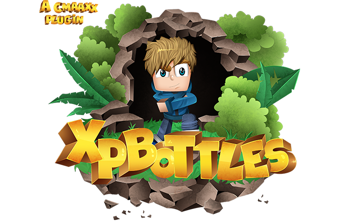

[![Contributors][contributors-shield]][contributors-url]
[![Forks][forks-shield]][forks-url]
[![Stargazers][stars-shield]][stars-url]
[![Issues][issues-shield]][issues-url]
[![GNU License][license-shield]][license-url]

<!-- PROJECT LOGO -->
 

  

  <h3 align="center">XpBottles</h3>

  

    Advanced exp bottle plugin!
     
    <a href="https://github.com/CodedRed-Spigot/XpBottles"><strong>Explore the docs »</strong></a>
     
     
    <a href="[site-url]">View Demo</a>
    ·
    <a href="https://github.com/CodedRed-Spigot/XpBottles/issues">Report Bug</a>
    ·
    <a href="https://github.com/CodedRed-Spigot/XpBottles/issues">Request Feature</a>
  

<!-- TABLE OF CONTENTS -->

  
<h2 style="display: inline-block">Table of Contents</h2>

  <ol>
    <li>
      <a href="#about-the-project">About The Project</a>
    </li>
<!--    <li>
      <a href="#getting-started">Getting Started</a>
      <ul>
        <li><a href="#prerequisites">Prerequisites</a></li>
        <li><a href="#installation">Installation</a></li>
      </ul>
    </li> -->
    <li><a href="#usage">Usage</a></li>
    <li><a href="#roadmap">Roadmap</a></li>
    <li><a href="#contributing">Contributing</a></li>
    <li><a href="#license">License</a></li>
    <li><a href="#contact">Contact</a></li>
  </ol>

<!-- ABOUT THE PROJECT -->
## About The Project

XpBottles is the ultimate exp plugin! Create exp bottles, add/take/reset exp from players, and more! 
The exp amount is saved in a hidden location so you will be able to customize the lore/name of the item to whatever you would like!
No restrictions.

<!-- GETTING STARTED
## Getting Started -->

<!-- To get a local copy up and running follow these simple steps. -->

<!-- USAGE EXAMPLES -->
## Usage

More info coming soon!
_For more examples, please refer to the [Documentation][site-url]_

<!-- ROADMAP -->
## Roadmap

See the [open issues](https://github.com/CodedRed-Spigot/XpBottles/issues) for a list of proposed features (and known issues).

<!-- CONTRIBUTING -->
## Contributing

Contributions are what make the open source community such an amazing place to be learn, inspire, and create. Any contributions you make are **greatly appreciated**.

1. Fork the Project
2. Create your Feature Branch (`git checkout -b feature/AwesomeFeature`)
3. Commit your Changes (`git commit -m 'Add some AwesomeFeature'`)
4. Push to the Branch (`git push origin feature/AwesomeFeature`)
5. Open a Pull Request

<!-- LICENSE -->
## License

Distributed under the GNU General Public License v3.0. See `LICENSE` for more information.

<!-- CONTACT -->
## Contact

CodedRed - [@twitter](https://twitter.com/devcodedred) - devcodedred@gmail.com

[@spigotmc](https://www.spigotmc.org/resources/authors/codedred.421005/)
Discord: CodedRed#0900

Project Link: [https://github.com/CodedRed-Spigot/XpBottles](https://github.com/CodedRed-Spigot/XpBottles)

<!-- MARKDOWN LINKS & IMAGES -->
<!-- https://www.markdownguide.org/basic-syntax/#reference-style-links -->
[contributors-shield]: https://img.shields.io/github/contributors/CodedRed-Spigot/XpBottles.svg?style=for-the-badge
[contributors-url]: https://github.com/CodedRed-Spigot/XpBottles/graphs/contributors
[forks-shield]: https://img.shields.io/github/forks/CodedRed-Spigot/XpBottles.svg?style=for-the-badge
[forks-url]: https://github.com/CodedRed-Spigot/XpBottles/network/members
[stars-shield]: https://img.shields.io/github/stars/CodedRed-Spigot/XpBottles.svg?style=for-the-badge
[stars-url]: https://github.com/CodedRed-Spigot/XpBottles/stargazers
[issues-shield]: https://img.shields.io/github/issues/CodedRed-Spigot/XpBottles.svg?style=for-the-badge
[issues-url]: https://github.com/CodedRed-Spigot/XpBottles/issues
[license-shield]: https://img.shields.io/github/license/CodedRed-Spigot/XpBottles.svg?style=for-the-badge
[license-url]: https://github.com/CodedRed-Spigot/XpBottles/blob/master/LICENSE.txt
[site-url]: https://www.spigotmc.org/resources/xpbottles-convert-exp-into-bottles.69233/
